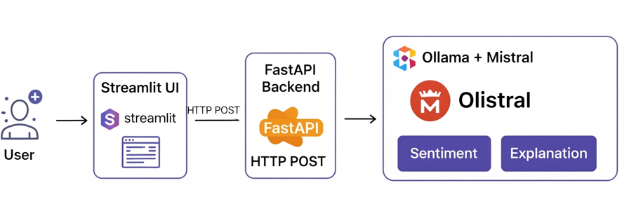

# 🎭 Local Sentiment Analyzer with Mistral and Ollama

A **100% local, private, and explainable** sentiment analyzer that runs on your machine with no internet connection and no data leaks.

This project is perfect for analyzing customer feedback, social media, or emails securely and offline.

**Built with:**

  * **FastAPI**: The backend API
  * **Streamlit**: The frontend UI
  * **Mistral via Ollama**: The local Large Language Model (LLM) for sentiment classification
  * **Explainable AI**: Shows *why* a specific sentiment was assigned

-----

## 🚀 Quick Start

### 1\. Prerequisites

Before you begin, ensure you have the following installed:

  * **Python 3.9** or higher
  * **Ollama**: Used to run the Mistral model locally. [Download here](https://ollama.com/download).
  * **Git**: (Optional) For cloning the repository.

✅ This project is compatible with **Windows, macOS, and Linux**.

### 2\. Setup

```bash
# Clone the repository
git clone https://github.com/your-username/sentiment-analyzer-mistral.git
cd sentiment-analyzer-mistral

# Create and activate a virtual environment
python -m venv venv
# On Windows:
venv\Scripts\activate
# On macOS/Linux:
source venv/bin/activate

# Install the required dependencies
pip install -r requirements.txt
```

### 3\. Download the Mistral Model

First, start the Ollama server in the background.

```bash
ollama serve
```

Then, in a **separate terminal window**, download the Mistral model. This is a one-time process and the download is approximately 4.1GB.

```bash
ollama pull mistral
```

### 4\. Run the Application

You will need **two terminal windows** for this step.

#### **Terminal 1: Start the FastAPI Backend**

This command starts the API server.

```bash
uvicorn backend.main:app --host 0.0.0.0 --port 8000 --reload
```

#### **Terminal 2: Start the Streamlit Frontend**

This command launches the user interface.

```bash
streamlit run frontend/app.py
```

The application will be accessible in your browser at: [**http://localhost:8501**](https://www.google.com/search?q=http://localhost:8501).

-----

## 🖼️ Screenshot

> 💡 `screenshots/sentiment-analyzer-home-screen.png`

-----

## 🧱 Architecture

The application's architecture is a simple, effective pipeline:

> 

  * **Frontend**: The user interface is built with **Streamlit** (`frontend/app.py`).
  * **Backend**: The API is powered by **FastAPI** (`backend/main.py`), handling analysis and explanation requests.
  * **Model**: The **Mistral** LLM runs locally via **Ollama**.
  * **Communication**: The frontend and backend communicate using JSON over `localhost`.

🔐 **No data ever leaves your machine, ensuring complete privacy.**

-----

## API EndPonits

  * **Get**: **/health** A simple health check to verify the application is running.
  * **Post**: **/analyze** Analyzes the sentiment of a given text input.
  * **Post**: **/explain** Explains the reasoning behind a sentiment analysis result.

-----

## 🛠️ Key Features

  * **Sentiment Classification**: Classifies text as **Positive**, **Negative**, or **Neutral**.
  * **Explainable AI**: Provides a clear explanation for each sentiment classification.
  * **Live Feedback**: Includes a live character counter and input validation.
  * **Intuitive UI**: Features color-coded results (🟢/🔴/🟡) and a "Clear Input" button for easy use.
  * **Robust Handling**: Detects and warns against non-text input (e.g., numbers).

-----

## 📂 Project Structure

```
sentiment-analyzer-mistral/
│
├── .gitignore               # Excludes virtual environments and cache
├── README.md                # This file
├── requirements.txt         # List of Python dependencies
│
├── backend/
│   └── main.py              # FastAPI application logic
│
├── frontend/
│   └── app.py               # Streamlit UI
│
└── screenshots/
    └── screenshot.png       # App screenshot (optional)
```

-----

## 📌 Usage Tips

  * **Be patient**: The analysis can take 5–60 seconds, as the model runs locally.
  * **Use natural language**: The model performs best with full sentences or phrases.
  * **Understand the "Why?"**: The explanation section is key to understanding the model's reasoning.
  * **Non-text input**: Inputs without letters (e.g., "123") will be flagged as low-confidence.
  * **Clear input**: Use the dedicated button to reset the text area and results.

-----

## 🚧 Future Improvements

  * Support for file uploads (TXT, CSV).
  * Export results to `.txt` or `.json` files.
  * Highlight key sentiment words within the input text.
  * Add a confidence score (e.g., "High", "Medium", "Low") for each result.
  * Add generate a response based on the sentiment (e.g., "Thank you for your positive feedback!").
  * Implement a history feature to track past analyses.
  * Add Docker support for simplified, one-click setup.
  * Implement multi-language sentiment analysis.

-----

## 🙌 Credits

Made with ❤️ by Sabelo Gumede for **private, powerful, and explainable AI**.

Have ideas or feedback? Feel free to open an issue or submit a pull request.

Keep building the future—locally\! 🚀

-----

## 📄 License

This project is licensed under the **MIT License**. For the full license text, please refer to the `LICENSE` file in the repository.